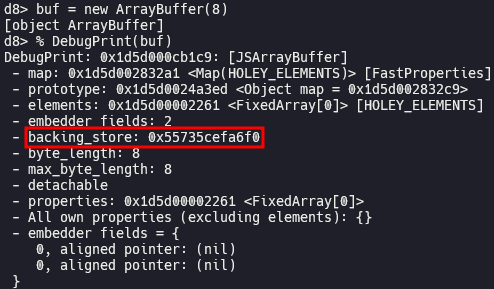
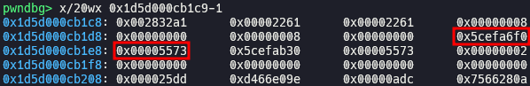
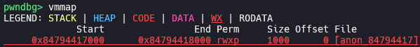
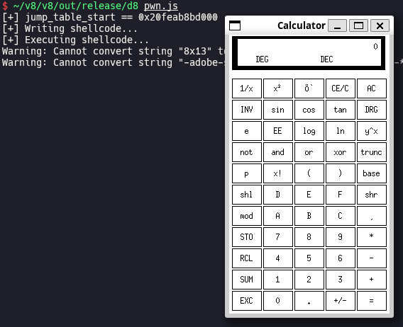

# Escaping V8 Sandbox via Overwriting WebAssembly Jump Table (Chromium < 100.0.4896.60, V8 < 10.0.136)

In this post, I will explain how to escape V8 sandbox via overwriting WebAssembly jump table for getting RCE, while we have limited exploitation primitives like sandboxed AAR/AAW.

## Setup

- Ubuntu 20.04.6 LTS (WSL)
- [7c369ec82136ac0afc559aaa0b31614840fcc0a0](https://chromium.googlesource.com/v8/v8.git/+/7c369ec82136ac0afc559aaa0b31614840fcc0a0) (Feb 15, 2022)

Save [`sandbox.diff`](./sandbox.diff) and [`setup.zsh`](./setup.zsh) in your working directory, and run `setup.zsh` (`zsh` is required).

[`sandbox.diff`](./sandbox.diff) is the same patch with [[sandbox] Add new Memory Corruption API](https://chromium.googlesource.com/v8/v8/+/4a12cb1022ba335ce087dcfe31b261355524b3bf) (May 20, 2022). Applying this patch, we can implement limited exploitation primitives using memory corruption API.

## Exploitation

### Implement exploitation primitives

We can implement sandboxed [`addrof`](./pwn.js#L7) primitive which returns address of any JavaScript object in V8 sandbox, using `Sandbox.getAddressOf`. Also, we can implement sandboxed [AAR](./pwn.js#L12)/[AAW](./pwn.js#L18) primitives which read and write value at arbitrary address in V8 sandbox, using `Sandbox.MemoryView`.

### Expand AAR/AAW

`ArrayBuffer` stores data in its backing store.





The address of backing store is saved in `ArrayBuffer` object as 8-byte full pointer. We can overwrite this pointer with arbitrary address using sandboxed AAW primitive. Then, the value we store in this `ArrayBuffer` will be written to the new backing store. That would be full AAR/AAW primitives, which work outside of V8 sandbox.

### Execute shellcode

When we construct a Wasm module, a memory region with RWX permission is allocated for compiling and executing Wasm function.



At the head of this region, there is jump table which is responsible to decide execution flow for Wasm function. In short, when Wasm function is called, `rip` moves to the jump table. So, if we overwrite jump table with arbitrary shellcode using full AAW primitive, the shellcode will be executed when Wasm function is called.

```bash
echo '(module (func (export "main")))' > pwn.wat
~/wabt/bin/wat2wasm pwn.wat # output: pwn.wasm
```

[`pwn.js`](./pwn.js)



## Patch

> [[wasm] Ship code protection via memory protection keys](https://chromium.googlesource.com/v8/v8.git/+/17b46632cba261c1eb9c87347a05867079e6a7b9) (Feb 15, 2022)
