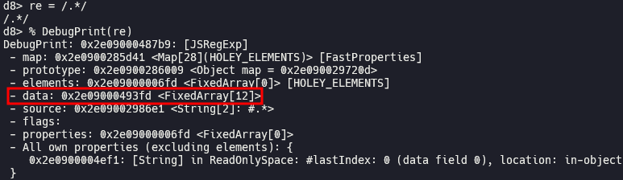
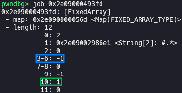
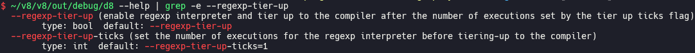
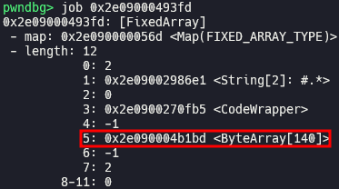
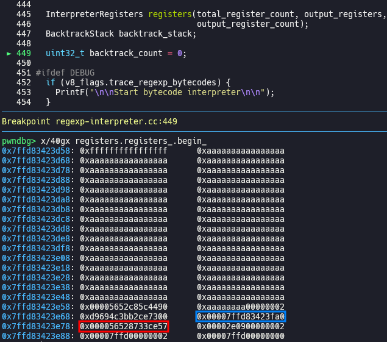
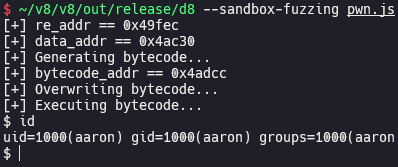

# Escaping V8 Sandbox via RegExp Bytecode (Chromium < 125.0.6422.60)

In this post, I will explain how to escape V8 sandbox to get RCE via `RegExp` bytecode, while we have limited exploitation primitives like `addrof` and sandboxed AAR/AAW.

## Setup

- Ubuntu 24.04.1 LTS
- [0c1231b6414d19468d6f7a35ff5b6167626f57a5](https://chromium.googlesource.com/v8/v8/+/0c1231b6414d19468d6f7a35ff5b6167626f57a5) (Mar 22nd, 2024)

Run [`setup.zsh`](./setup.zsh) in your working directory.

## Analysis

### RegExp bytecode

[`RegExp`](https://developer.mozilla.org/docs/Web/JavaScript/Reference/Global_Objects/RegExp) object is used for matching text with regular expression, and it is implemented as [`JSRegExp`](https://source.chromium.org/chromium/v8/v8/+/0c1231b6414d19468d6f7a35ff5b6167626f57a5:src/objects/js-regexp.h;l=38) class.

When `JSRegExp` object is constructed, data array is initialized.

Data array is consisted of 12 fields. Among them, [`code`](https://source.chromium.org/chromium/v8/v8/+/0c1231b6414d19468d6f7a35ff5b6167626f57a5:src/objects/js-regexp.h;l=70) in 4th field and [`bytecode`](https://source.chromium.org/chromium/v8/v8/+/0c1231b6414d19468d6f7a35ff5b6167626f57a5:src/objects/js-regexp.h;l=70) in 6th field store the code which is executed when [`exec()`](https://developer.mozilla.org/docs/Web/JavaScript/Reference/Global_Objects/RegExp/exec) method is called, and they are initialized to [`kUninitializedValue`](https://source.chromium.org/chromium/v8/v8/+/0c1231b6414d19468d6f7a35ff5b6167626f57a5:src/objects/js-regexp.h;l=245) (blue box). `bytecode` is compiled when `exec()` is called for the first time, and `code` is compiled after `exec()` is called a certain number ([`regexp_tier_up_ticks`](https://source.chromium.org/chromium/v8/v8/+/0c1231b6414d19468d6f7a35ff5b6167626f57a5:src/flags/flag-definitions.h;l=2454)) of times. [`TierUpTick`](https://source.chromium.org/chromium/v8/v8/+/0c1231b6414d19468d6f7a35ff5b6167626f57a5:src/objects/js-regexp.h;l=131) in 11th field is initialized to `regexp_tier_up_ticks` (green box), and decreased by 1 each time `exec()` is called. When `TierupTick` reaches to 0, tier-up is proceeded and `code` is compiled.

[`regexp_tier_up`](https://source.chromium.org/chromium/v8/v8/+/0c1231b6414d19468d6f7a35ff5b6167626f57a5:src/flags/flag-definitions.h;l=2450) and `regexp_tier_up_ticks` can be controlled by run-time options.

`exec()` is handled by [`RUNTIME_FUNCTION(Runtime_RegExpExec)`](https://source.chromium.org/chromium/v8/v8/+/0c1231b6414d19468d6f7a35ff5b6167626f57a5:src/runtime/runtime-regexp.cc;l=928). Before tier-up, It goes into [`RegExpExec()`](https://source.chromium.org/chromium/v8/v8/+/0c1231b6414d19468d6f7a35ff5b6167626f57a5:src/runtime/runtime-regexp.cc;l=937) → [`RegExp::Exec()`](https://source.chromium.org/chromium/v8/v8/+/0c1231b6414d19468d6f7a35ff5b6167626f57a5:src/runtime/runtime-regexp.cc;l=909) → [`RegExpImpl::IrregexpExec()`](https://source.chromium.org/chromium/v8/v8/+/0c1231b6414d19468d6f7a35ff5b6167626f57a5:src/regexp/regexp.cc;l=334) → [`RegExpImpl::IrregexpExecRaw()`](https://source.chromium.org/chromium/v8/v8/+/0c1231b6414d19468d6f7a35ff5b6167626f57a5:src/regexp/regexp.cc;l=797) → [`IrregexpInterpreter::MatchForCallFromRuntime()`](https://source.chromium.org/chromium/v8/v8/+/0c1231b6414d19468d6f7a35ff5b6167626f57a5:src/regexp/regexp.cc;l=724) → [`IrregexpInterpreter::Match()`](https://source.chromium.org/chromium/v8/v8/+/0c1231b6414d19468d6f7a35ff5b6167626f57a5:src/regexp/regexp-interpreter.cc;l=1152) → [`IrregexpInterpreter::MatchInternal()`](https://source.chromium.org/chromium/v8/v8/+/0c1231b6414d19468d6f7a35ff5b6167626f57a5:src/regexp/regexp-interpreter.cc;l=1068) → [`RawMatch()`](https://source.chromium.org/chromium/v8/v8/+/0c1231b6414d19468d6f7a35ff5b6167626f57a5:src/regexp/regexp-interpreter.cc;l=1101), and bytecode is executed in [`RawMatch()`](https://source.chromium.org/chromium/v8/v8/+/0c1231b6414d19468d6f7a35ff5b6167626f57a5:src/regexp/regexp-interpreter.cc;l=386).

## Exploitation

### Stack buffer overflow in RawMatch()

Array in `bytecode` field of data array is inside of V8 sandbox, so we can arbitrarily edit bytecode using sandboxed AAW primitive, which means that we can execute [arbitrary bytecode](https://source.chromium.org/chromium/v8/v8/+/0c1231b6414d19468d6f7a35ff5b6167626f57a5:src/regexp/regexp-bytecodes.h;l=34).

Both of virtual [`registers`](https://source.chromium.org/chromium/v8/v8/+/0c1231b6414d19468d6f7a35ff5b6167626f57a5:src/regexp/regexp-interpreter.cc;l=445) and [`backtrack_stack`](https://source.chromium.org/chromium/v8/v8/+/0c1231b6414d19468d6f7a35ff5b6167626f57a5:src/regexp/regexp-interpreter.cc;l=445) used while executing bytecode are allocated in stack frame of `RawMatch()`. Bytecode accesses to the values in `registers` via their index. However, there is no bounds check when accessing to `registers`, thus we can read and write out of bounds of the stack frame. This would be stack buffer overflow, so we can just do ROP and get shell.

### Get binary base address and stack address

We can get binary base address of `d8` from the return address of `RawMatch()` (red box), and get stack address from the stack frame pointer of `RawMatch()` (blue box) stored at `rbp`. Then, we can use the gadgets in `d8` binary and stack address for ROP.

### Execute command via execve

We can execute arbitrary shell command by writing arbitrary command (e.g. `/bin/sh`) not to be overlapped with ROP chain and passing it to the first argument of `execve` system call.

[`pwn.js`](./pwn.js)

## Patch

> [[regex] Check bounds on register access in interpreter](https://chromium.googlesource.com/v8/v8/+/b9349d97fd44aec615307c9d00697152da95a66a) (Mar 22nd, 2024)
>
> Registers in the interpreter are stored on the stack/heap outside the sandbox. The register index is stored in the bytecode, which is (not yet) in truested space.

## References

- [V8 Sandbox escape via regexp - Chromium Issues](https://issues.chromium.org/issues/330404819)
- [V8-Sandbox-Escape-via-Regexp - rycbar77 (Github)](https://github.com/rycbar77/V8-Sandbox-Escape-via-Regexp)
