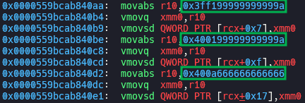
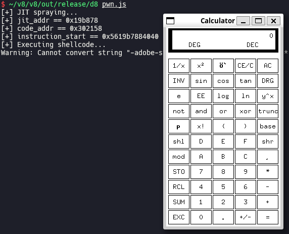

# Escaping V8 Sandbox via Turbofan JIT Spraying: Part 2 (100.0.4896.60 <= Chromium < 117.0.5938.62)

After the [patch](https://chromium.googlesource.com/v8/v8/+/7fc4868e477cc7cb7ef8c304fff214ea83498e7a) for the exploitation technique explained in [part 1](https://aaronsjcho.github.io/Escaping-V8-Sandbox-via-Turbofan-JIT-Spraying-Part-1/), we still can hijack execution flow via Turbofan JIT spraying. I will explain about the new technique in this post.

I recommend you to read part 1 first, because I will omit many overlapping contents in here.

## Setup

- Ubuntu 22.04.5 LTS (WSL)
- [4512c6eb7189c21f39420ddf8d9ff4f05a4a39b4](https://chromium.googlesource.com/v8/v8/+/4512c6eb7189c21f39420ddf8d9ff4f05a4a39b4) (Jul 11th, 2023)

Run [`setup.zsh`](./setup.zsh) in your working directory.

## Exploitation

### Hijack execution flow

```js
// flags: --allow-natives-syntax --shell

function jit() { return [1.1, 2.2, 3.3]; }

for (let i = 0; i < 0x10000; i++) { jit(); jit(); } // compile via turbofan

% DebugPrint(jit);
```




When `jit()` is called, `rip` moves to `instruction_start` pointer in `code` of `jit()`, which is inside of V8 sandbox. Using sandboxed AAW primitive, we can overwrite `instruction_start` pointer with arbitrary value, e.g. the address of number which we inserted to the optimized code. If so, the number acts like an 8-byte shellcode.

You have to install `/bin/xcalc` by running `sudo apt install -y x11-apps` before executing [`pwn.js`](./pwn.js) if you are using WSL.



## Bisection

> [[ext-code-space] Enable external code space on x64 and desktop arm64](https://chromium.googlesource.com/v8/v8/+/7fc4868e477cc7cb7ef8c304fff214ea83498e7a) (Jan 24th, 2022)

[`v8_enable_external_code_space`](https://source.chromium.org/chromium/v8/v8/+/7fc4868e477cc7cb7ef8c304fff214ea83498e7a:BUILD.gn;l=415) was set to `true` in `x64` in the commit above, so [`code_entry_point`](https://source.chromium.org/chromium/v8/v8/+/7fc4868e477cc7cb7ef8c304fff214ea83498e7a:src/objects/code.h;l=86) in [`CodeDataContainer`](https://source.chromium.org/chromium/v8/v8/+/7fc4868e477cc7cb7ef8c304fff214ea83498e7a:src/objects/code.h;l=46) became available. As a result, the exploitation technique explained in this post was introduced.

## Patch

> [[sandbox] Enable code pointer sandboxing](https://chromium.googlesource.com/v8/v8/+/c8d039b05081b474ef751411a5c76ca01900e49a) (Jul 11th, 2023)
>
> [Revert "[sandbox] Enable code pointer sandboxing"](https://chromium.googlesource.com/v8/v8/+/bc795ebd90a5a7c957b644da5fac369eb88aa87a) (Jul 11th, 2023)
>
> [Reland "[sandbox] Enable code pointer sandboxing"](https://chromium.googlesource.com/v8/v8/+/7df23d5163a10a12e4b4262dd4e78cfb7ec97be0) (Jul 11th, 2023)
